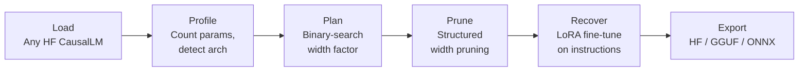

# qunart

**Universal LLM compression framework — target a deployment budget, not a sparsity ratio.**

qunart shrinks large language models so they run on phones and edge devices. You hand it a model and a size budget (`--target-size-gb 1.5`), and it returns a smaller model that still works, packaged for on-device inference.



## What Makes It Different

| Tool | Interface | Approach |
|------|-----------|----------|
| LLM-Pruner | `--pruning_ratio 0.25` | Sparsity ratio in |
| SliceGPT | `--sparsity 0.25` | Sparsity ratio in |
| Wanda | `--sparsity_ratio 0.5` | Sparsity ratio in |
| **qunart** | **`--target-size-gb 1.5`** | **Deployment budget in** |

Every other tool asks "what sparsity ratio do you want?" qunart asks "what device are you deploying to?" — and binary-searches the width scaling factor to land there.

## Quick Start

```bash
cd v3
pip install -e .

# Plan only (instant, <1s, no GPU needed)
qunart --model TinyLlama/TinyLlama-1.1B-Chat-v1.0 \
       --output ./compressed --target-size-gb 0.8 --dry-run

# Full pipeline
qunart --model TinyLlama/TinyLlama-1.1B-Chat-v1.0 \
       --output ./compressed --target-size-gb 0.8

# With GGUF export for mobile deployment
qunart --model TinyLlama/TinyLlama-1.1B-Chat-v1.0 \
       --output ./compressed --target-size-gb 0.8 --export gguf
```

## Results

| Model | Params | Disk (Q4) | PPL ↓ | HellaSwag | ARC-e | PIQA | tok/s | Peak RAM |
| :--- | :--- | :--- | :--- | :--- | :--- | :--- | :--- | :--- |
| **TinyLlama-1.1B-Chat (Stock)** | 1,100,048,384 | 664 MB | 10.82 | TBD | TBD | TBD | TBD | TBD |
| **qunart-pruned (TinyLlama, Greedy, +LoRA)** | 656,346,624 | 395 MB | 18.24 | TBD | TBD | TBD | TBD | TBD |
| **qunart-pruned (TinyLlama, QUBO, +LoRA)** | 656,346,624 | 395 MB | TBD | TBD | TBD | TBD | TBD | TBD |
| **qunart-pruned (TinyLlama, Greedy, No Recovery)** | 656,346,624 | 395 MB | 42.51 | TBD | TBD | TBD | TBD | TBD |
| **Phi-3-mini-4k-instruct (Stock)** | 3,821,079,552 | 2.31 GB | 7.48 | TBD | TBD | TBD | TBD | TBD |
| **qunart-pruned (Phi-3-mini, 50% width)** | 2,014,352,384 | 1.21 GB | TBD* | TBD* | TBD* | TBD* | TBD | TBD |

*See [`v3/results/RESULTS.md`](v3/results/RESULTS.md) for full benchmark details.*

## Supported Architectures

| Architecture | Model families | Pruner |
|-------------|---------------|--------|
| `LlamaForCausalLM` | Llama, Llama-2, Llama-3 | `LlamaWidthPruner` |
| `Qwen2ForCausalLM` | Qwen-2 | `LlamaWidthPruner` |
| `MistralForCausalLM` | Mistral | `LlamaWidthPruner` |
| `Phi3ForCausalLM` | Phi-3 | `Phi3WidthPruner` |

## Neuron Selection & QUBO Formulation

qunart formulates neuron selection as a Quadratic Unconstrained Binary Optimization (QUBO) problem with a pairwise redundancy penalty — penalizing keeping two neurons whose weight vectors are highly correlated:

$$\min \; -\sum_i I_i \cdot x_i \;+\; \lambda_{\text{red}} \sum_{i<j} S_{ij} \cdot x_i x_j \;+\; \lambda_{\text{card}} \left(\sum_i x_i - K\right)^2$$

where $S_{ij}$ is the cosine similarity between concatenated `[gate_i ; up_i]` weight rows (clamped $\ge 0$).

> **Note on Optimization & Quantum Compatibility:**  
> Neuron selection is formulated as a QUBO and solved classically via simulated annealing (using D-Wave's `neal` library when installed) with a greedy top-$K$ fallback. The mathematical formulation is quantum-annealer-compatible (can be dispatched to D-Wave Leap QPUs), but all current benchmark results use classical solvers.

Use `--selection-method qubo` to enable. Default is `greedy` (top-K by importance).

## Caveats (Read This)

- **Recovery budget.** Published structured-pruning work recovers with far more compute than this pipeline uses (LLM-Pruner: ~50k samples; Sheared-LLaMA: 50B tokens; Minitron: 94B tokens vs qunart default ~1M tokens).
- **Structural caveat.** Slicing the residual stream by index is arbitrary — channel $k$ is a basis coordinate shared across all layers. Quality loss will exceed what parameter count alone suggests. (See [`v3/NOTES.md`](v3/NOTES.md) for SliceGPT rotation design).
- **Measured vs Estimated.** Perplexity and parameter counts are verified from actual runs. On-device metrics are marked TBD pending hardware tethering.

## Project Structure

- `v3/` — Active framework codebase (CLI, GUI, core compression engine, tests, documentation).
- `archive/` — Historical prototypes (v1, v2).

## License

MIT
