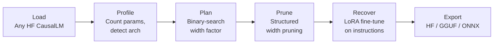

# qunart

**Universal LLM compression framework — target a deployment budget, not a sparsity ratio.**

qunart shrinks large language models so they run on phones and edge devices. You hand it a model and a size budget (`--target-size-gb 1.5`), and it returns a smaller model that still works, packaged for on-device inference.

## How It Works



**Method:** Structured width pruning that holds `head_dim` constant so rotary embeddings stay valid without rebuilding, preserves the GQA grouping ratio (`num_heads % num_kv_heads == 0`), ranks MLP neurons by importance, then LoRA-recovers quality on an instruction corpus.

**Width pruning over depth pruning:** Every layer survives, each one just gets thinner. Dropping whole layers severs residual paths; narrowing preserves every one of them.

## What Makes It Different

| Tool | Interface | Approach |
|------|-----------|----------|
| LLM-Pruner | `--pruning_ratio 0.25` | Sparsity ratio in |
| SliceGPT | `--sparsity 0.25` | Sparsity ratio in |
| Wanda | `--sparsity_ratio 0.5` | Sparsity ratio in |
| **qunart** | **`--target-size-gb 1.5`** | **Deployment budget in** |

Every other tool asks "what sparsity ratio do you want?" qunart asks "what device are you deploying to?" — and binary-searches the width scaling factor to land there.

## Quick Start

```bash
pip install -e .

# Plan only (instant, no GPU needed)
qunart --model TinyLlama/TinyLlama-1.1B-Chat-v1.0 \
       --output ./compressed --target-size-gb 0.8 --dry-run

# Full pipeline
qunart --model TinyLlama/TinyLlama-1.1B-Chat-v1.0 \
       --output ./compressed --target-size-gb 0.8

# With GGUF export for mobile deployment
qunart --model TinyLlama/TinyLlama-1.1B-Chat-v1.0 \
       --output ./compressed --target-size-gb 0.8 --export gguf
```

## Results

See [`results/RESULTS.md`](results/RESULTS.md) for the full benchmark matrix.

*Results are generated by `scripts/evaluate.py` and `scripts/smoke.py`. Every number traces to a file in `results/`.*

## Supported Architectures

| Architecture | Model families | Pruner |
|-------------|---------------|--------|
| `LlamaForCausalLM` | Llama, Llama-2, Llama-3 | `LlamaWidthPruner` |
| `Qwen2ForCausalLM` | Qwen-2 | `LlamaWidthPruner` |
| `MistralForCausalLM` | Mistral | `LlamaWidthPruner` |
| `Phi3ForCausalLM` | Phi-3 | `Phi3WidthPruner` |

Phi-3 requires its own pruner because it fuses `q/k/v` into `qkv_proj` and `gate/up` into `gate_up_proj`.

## QUBO Neuron Selection

qunart includes a QUBO (Quadratic Unconstrained Binary Optimization) formulation for neuron selection that adds a genuine pairwise redundancy penalty — two neurons whose weight vectors are highly correlated are penalised for being kept together:

```
min  -Sum_i I_i * x_i  +  lambda_red * Sum_{i<j} S_ij * x_i * x_j  +  lambda_card * (Sum_i x_i - K)^2
```

where `S_ij` is the cosine similarity between concatenated `[gate_i ; up_i]` weight rows (clamped >= 0).

Use `--selection-method qubo` to enable. Default is `greedy` (top-K by importance).

## Caveats (Read This)

**Recovery budget.** Published structured-pruning work recovers with far more compute than this pipeline uses:

| Work | Recovery budget |
|------|----------------|
| LLM-Pruner | ~50k LoRA samples |
| Sheared-LLaMA | 50B tokens continued pretraining |
| Minitron | ~94B tokens distillation |
| **qunart** (default) | **~1M tokens** (500 steps x 2k Alpaca samples) |

Quality retention should be evaluated with this context in mind.

**Structural caveat.** Slicing the residual stream by index is arbitrary — channel `k` is a basis coordinate shared across all layers, not the k-th most important feature. Quality loss will exceed what the parameter count alone suggests. A principled fix (SliceGPT-style rotation before slicing) is planned but not yet implemented.

**QUBO vs greedy.** The QUBO formulation with redundancy penalty is theoretically better-motivated than plain greedy, but may show no measurable perplexity gain on small models. Results are reported honestly in `results/RESULTS.md`. Greedy is kept as default.

**What is measured vs estimated.** Perplexity and parameter counts in `results/RESULTS.md` come from actual runs. On-device tok/s and RAM are marked TBD until measured on physical hardware.

## Python API

```python
from qunart import CompressionTarget, CompressionPipeline

target = CompressionTarget(target_size_gb=1.5)
pipeline = CompressionPipeline(target)
pipeline.run("TinyLlama/TinyLlama-1.1B-Chat-v1.0", "./output")
```

## Project Structure

```
qunart/
  __init__.py       # Public API: CompressionTarget, CompressionPipeline
  config.py         # CompressionTarget dataclass
  loader.py         # Model + tokenizer loading
  profiler.py       # Parameter counting + size estimation
  importance.py     # Neuron importance scoring
  qubo.py           # QUBO solver (greedy + dwave-neal)
  pruner.py         # LlamaWidthPruner + Phi3WidthPruner
  recover.py        # LoRA attach + fine-tune
  exporter.py       # HF / GGUF / ONNX export
  pipeline.py       # End-to-end orchestration
cli.py              # CLI entry point
gui.py              # CustomTkinter desktop GUI
tests/              # CPU-only, offline, fast
scripts/            # smoke.py, evaluate.py
docs/               # DEPLOY_ANDROID.md
results/            # Benchmark outputs
```

## License

MIT
